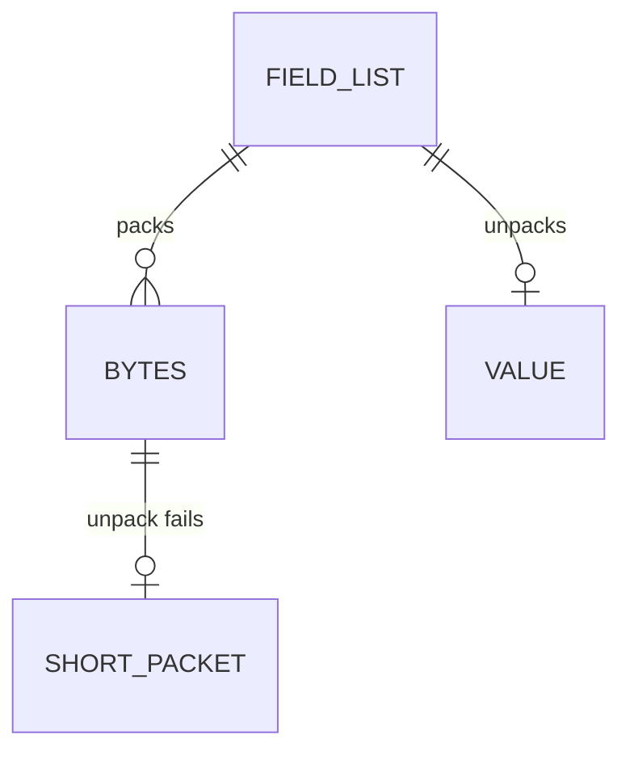

# Data model

There is no database. The library does not store a packet after the call returns.

## Entities

| Entity | Attributes | Constraints |
|--------|------------|-------------|
| Field list | ordered fields, each with a name, a width, and an endian | names are for the value and for errors; they are not written |
| Bytes | the packed buffer | length is the sum of the fields that are present |
| Short packet | field name, bytes needed, bytes left | returned instead of a value |

## Relationships

One field list describes one packet shape. One pack call yields one buffer or an error and zero bytes. One unpack call yields one value or one error and zero values.

## Migration

No table and no migration tool. There is nothing to reverse. A change to a caller's field list is that caller's change. The library does not version the caller's layout.

## Seed data

The golden hex in `_docs/00_problem/input_data/expected_results/results_report.md` is the seed for every environment. Development and the CI run use the same file. There is no staging database to seed.

## Compatibility

A new field helper is additive. Changing the bytes of an existing helper is a breaking change for every caller who already shipped that layout, so the golden fixture must keep matching.
