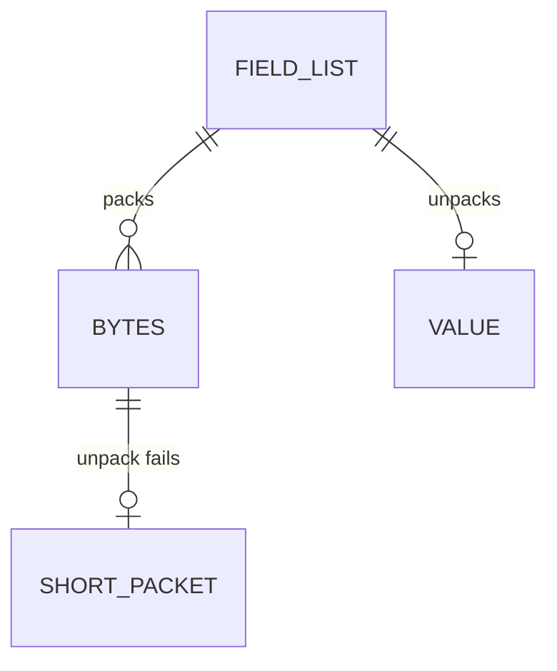

# Data model

There is no database. The library does not store a packet after the call returns.

## Entities

| Entity | Attributes | Constraints |
|--------|------------|-------------|
| Field list | ordered fields, each with a name, a width, and an endian | names are for the value and for errors; they are not written. A continuing group takes an anchor equal to the next value id. The anchor is not written and does not consume a slot. `packed` and `times` take their item count from an earlier field, and a `when` tests an earlier field, in the same scope (the top level, one `repeat` or `times` round, one `list` or `dict` element, or a nested row; loop 13). A `repeat` or `times` round holds no other `repeat` or `times` in C#, TypeScript and Java. A `bool` or empty group stands only directly under `flags` or a flag-byte bit, and one flags byte holds at most 8 bits. In C++ a field has an order id and a bound struct member, not a name; the order id is what errors report |
| Bytes | the packed buffer | length is the sum of the fields that are present |
| Short packet | field name, bytes needed, bytes left. C++: field order id, byte offset, bytes needed | returned instead of a value. C++ returns a `Result` and keeps the fields read before the failure. Outside C++ the same shape is also the interim error for a bad value (negative or absent count, invalid UTF-8, a round that reads nothing); each package sets its own `needed` and `left` until C15 |

## Relationships

```mermaid
erDiagram
    FIELD_LIST ||--o{ BYTES : packs
    BYTES ||--o| SHORT_PACKET : "unpack fails"
    FIELD_LIST ||--o| VALUE : unpacks
```

One field list describes one packet shape. One pack call yields one buffer or an error and zero bytes. One unpack call yields one value or one error and zero values. In C++ pack writes into the caller's buffer and reports the length or the failing offset, and unpack fills the caller's row.

## Migration

No table and no migration tool. There is nothing to reverse. A change to a caller's field list is that caller's change. The library does not version the caller's layout.

## Seed data

The golden hex in `fixtures/golden.hex` (the position row; CI reads this file) is the seed for every environment. Development and the CI run use the same file. There is no staging database to seed.

## Compatibility

A new field helper is additive. Changing the bytes of an existing helper is a breaking change for every caller who already shipped that layout, so the golden fixture must keep matching.
