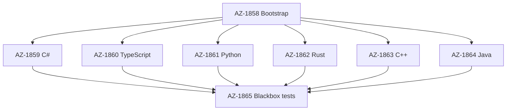

# Epics — packbin

LESSONS.md is absent. No estimation lesson applies.

Cross-cutting epics: none. The library does not log, authenticate, or load configuration. Registry tokens stay in GitHub Actions secrets.

Tracker: Jira project AZ on denyspopov.atlassian.net.

## Order

| Order | Key | Epic | Type | Effort | Depends on |
|-------|-----|------|------|--------|------------|
| 1 | AZ-1858 | Bootstrap and initial structure | bootstrap | M / 5 | — |
| 2 | AZ-1859 | C# package | component | M / 5 | AZ-1858 |
| 2 | AZ-1860 | TypeScript package | component | M / 5 | AZ-1858 |
| 2 | AZ-1861 | Python package | component | M / 5 | AZ-1858 |
| 2 | AZ-1862 | Rust package | component | M / 5 | AZ-1858 |
| 2 | AZ-1863 | C++ package | component | M / 5 | AZ-1858 |
| 2 | AZ-1864 | Java package | component | M / 5 | AZ-1858 |
| 3 | AZ-1865 | Blackbox tests | tests | M / 5 | the six packages |

The six language epics are the same order. Each is pack, unpack, and that registry's publish. Full descriptions are on the Jira issues.
