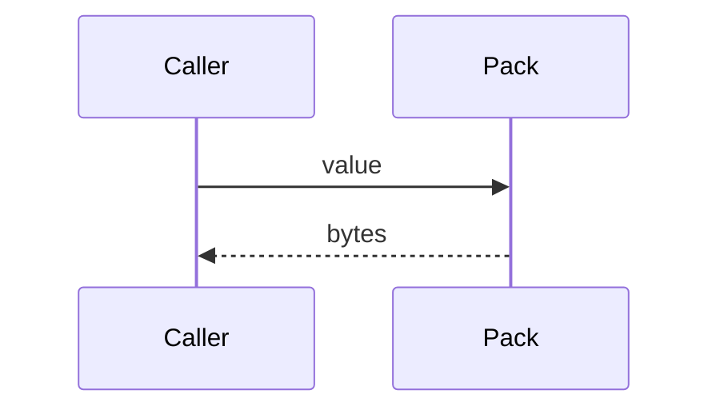
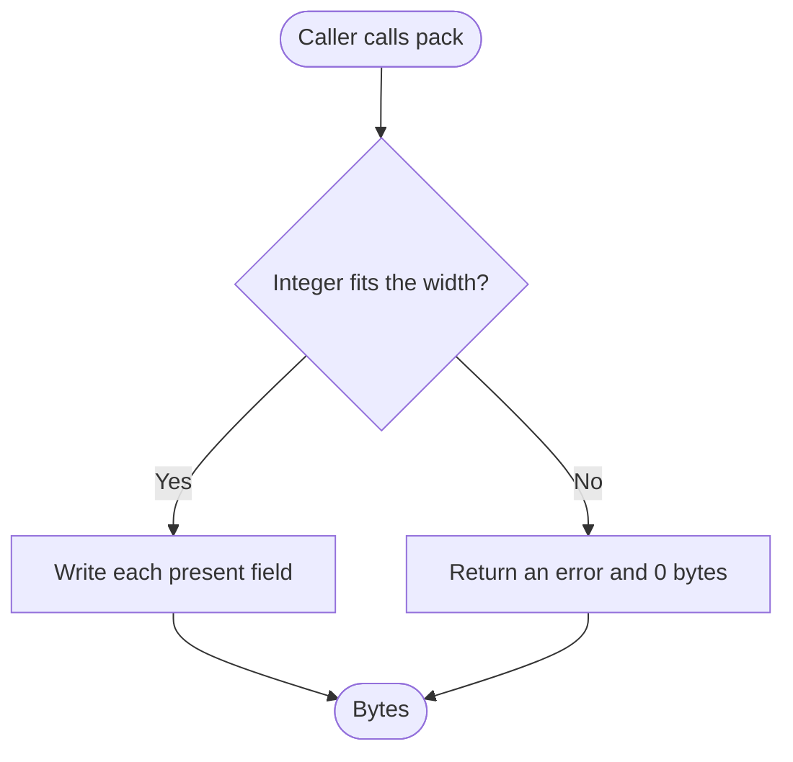
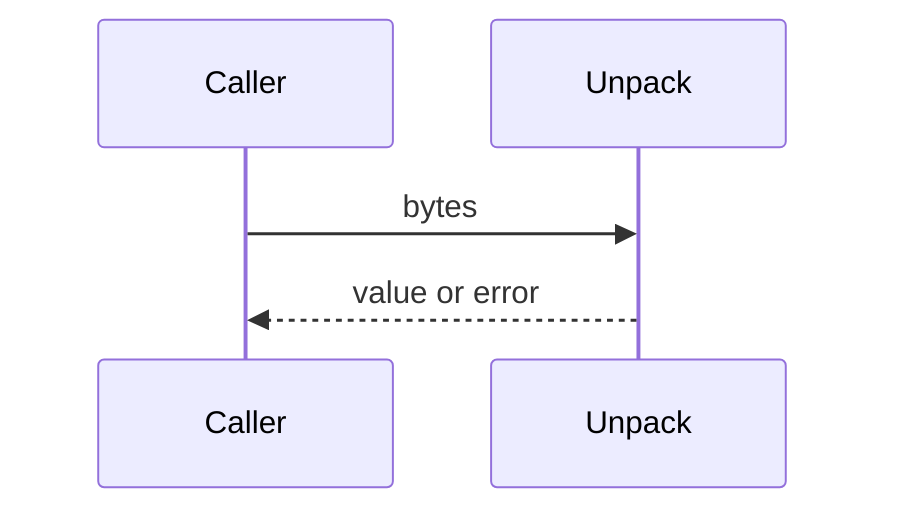
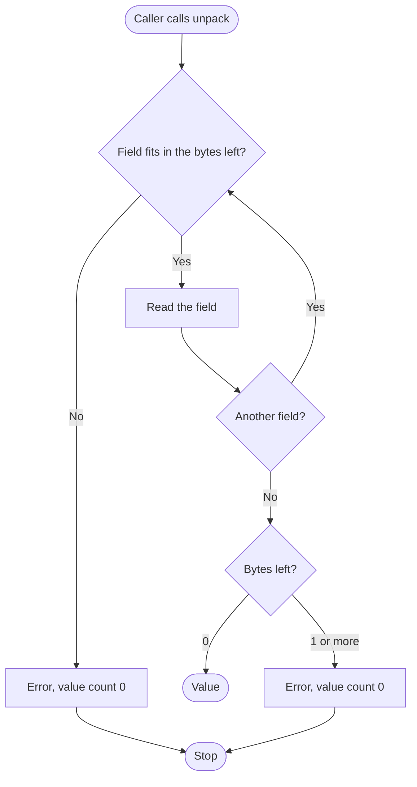
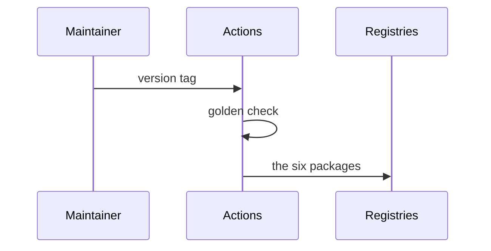
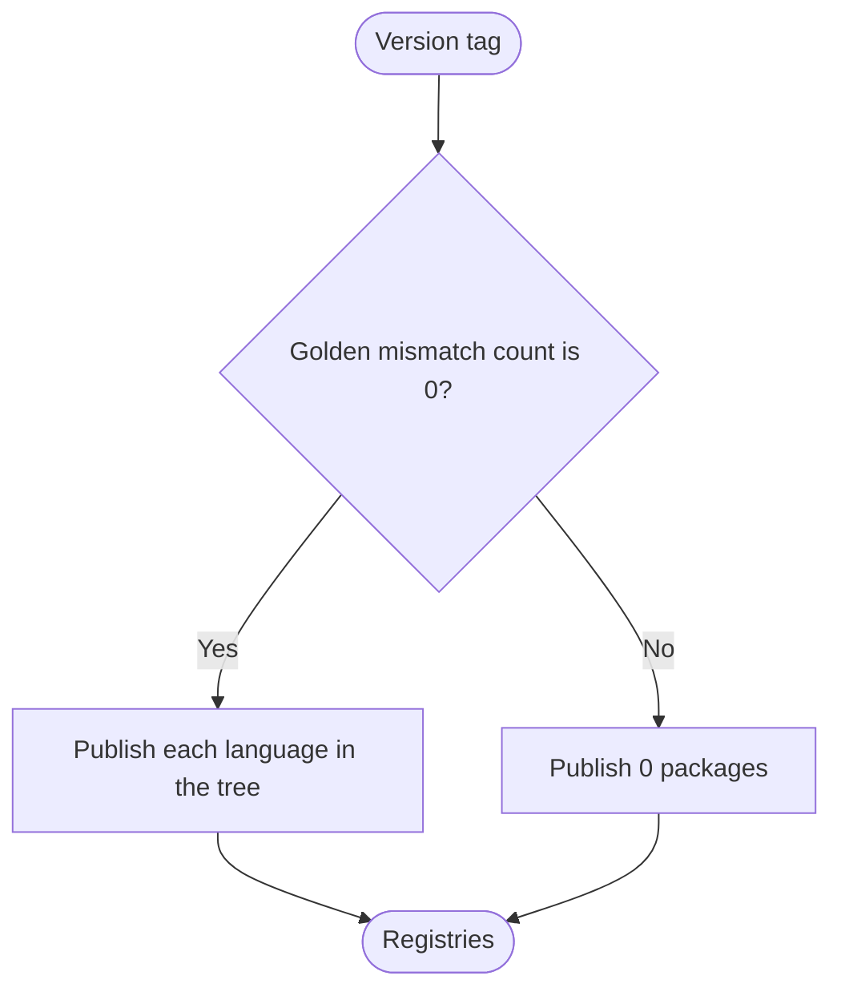

# packbin — System Flows

## Flow Inventory

| # | Flow Name | Trigger | Primary Components | Criticality |
|---|-----------|---------|-------------------|-------------|
| F1 | Pack | caller has a value | any of the six language packages | High |
| F2 | Unpack | caller has bytes | any of the six language packages | High |
| F3 | Publish | version tag | GitHub Actions | High |

## Flow Dependencies

| Flow | Depends On | Shares Data With |
|------|-----------|-----------------|
| F1 | a field list | F2, via the golden fixture |
| F2 | F1's byte layout | F1 |
| F3 | F1 and F2 passing on that commit | the same hex |

## Flow F1: Pack

### Description

The caller passes a value. Pack writes only the fields that are present and returns the bytes.

### Preconditions

- The field list is the one the caller intends for this packet
- Each present integer fits its width

### Sequence Diagram

### Flowchart

### Data Flow

| Step | From | To | Data | Format |
|------|------|----|------|--------|
| 1 | Caller | Pack | field values | the language's numbers |
| 2 | Pack | Caller | packet | raw bytes |

### Error Scenarios

| Error | Where | Detection | Recovery |
|-------|-------|-----------|----------|
| Integer outside the width | Pack | the value does not fit | 0 bytes written |

### Performance Expectations

| Metric | Target | Notes |
|--------|--------|-------|
| End-to-end latency | part of the 1 second budget | 100000 round trips with unpack |
| Throughput | 100000 round trips ≤ 1 second | one core, position fixture |

## Flow F2: Unpack

### Description

The caller passes a buffer. Unpack returns the value, or an error and no value.

### Preconditions

- The field list matches the layout that produced the buffer

### Sequence Diagram

### Flowchart

### Data Flow

| Step | From | To | Data | Format |
|------|------|----|------|--------|
| 1 | Caller | Unpack | packet | raw bytes |
| 2 | Unpack | Caller | fields or a short packet | value, or field name plus two counts |

### Error Scenarios

| Error | Where | Detection | Recovery |
|-------|-------|-----------|----------|
| Short field | Unpack | remaining bytes are fewer than the width | no value; the next call is independent |
| Trailing bytes | Unpack | bytes remain after the list | no value |

### Performance Expectations

| Metric | Target | Notes |
|--------|--------|-------|
| End-to-end latency | part of the 1 second budget | measured with pack |
| Throughput | 100000 round trips ≤ 1 second | one core |

## Flow F3: Publish

### Description

A version tag on GitHub builds the languages in that commit and pushes the matching public packages.

### Preconditions

- Tests passed on the commit
- All six languages' golden bytes match

### Sequence Diagram

### Flowchart

### Data Flow

| Step | From | To | Data | Format |
|------|------|----|------|--------|
| 1 | Git tag | Actions | commit | git |
| 2 | Actions | the six registries | packages | one artifact per language |

### Error Scenarios

| Error | Where | Detection | Recovery |
|-------|-------|-----------|----------|
| Golden mismatch | Actions | byte mismatch count greater than 0 | 0 packages published |
| Language absent | Actions | that project is not in the tree | 0 packages for that registry |

### Performance Expectations

| Metric | Target | Notes |
|--------|--------|-------|
| End-to-end latency | the check fails the workflow | not a latency SLO |
| Throughput | one publish per tag | first tag is exactly six packages |
