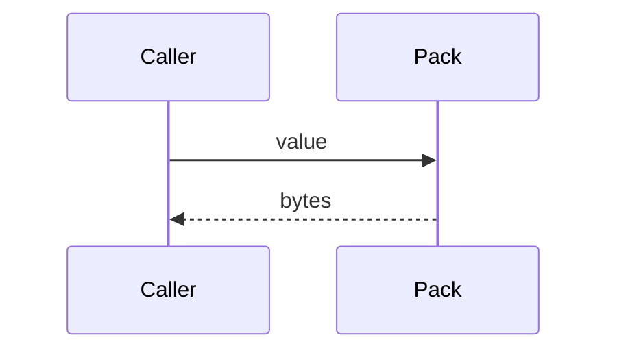
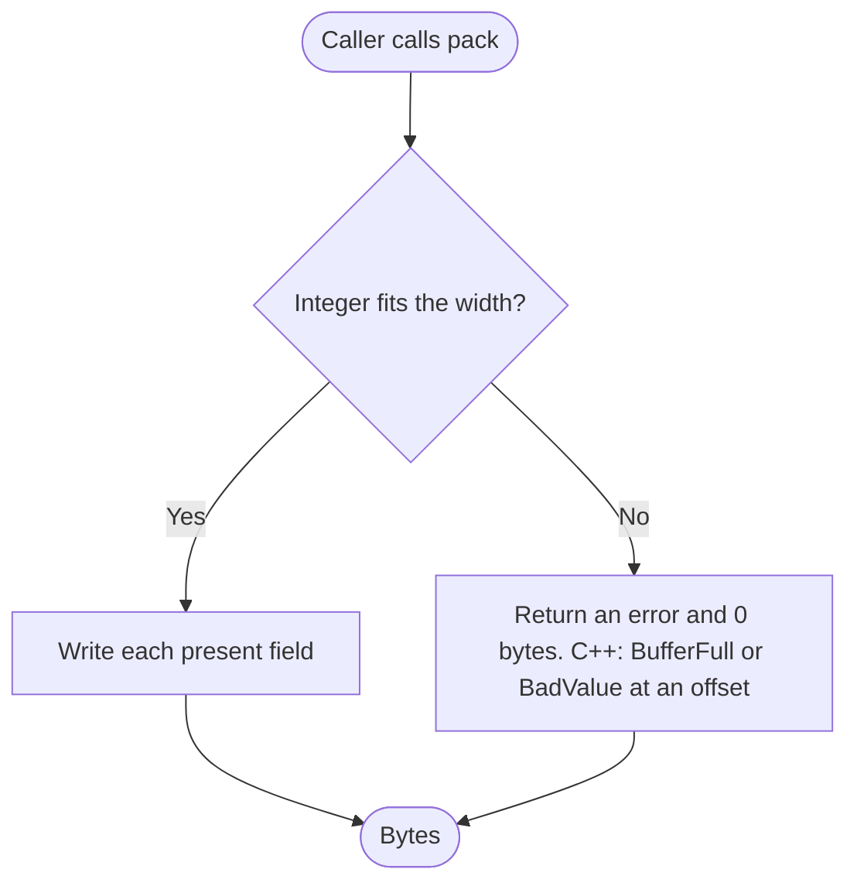
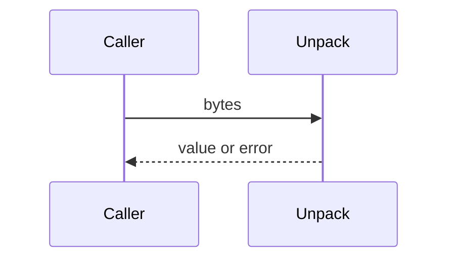
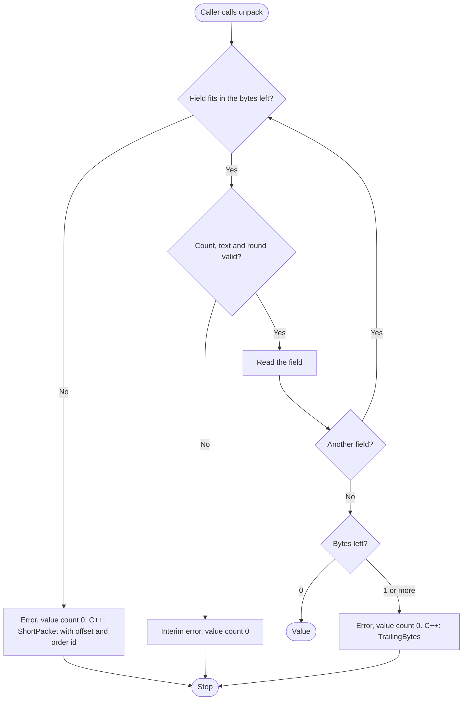
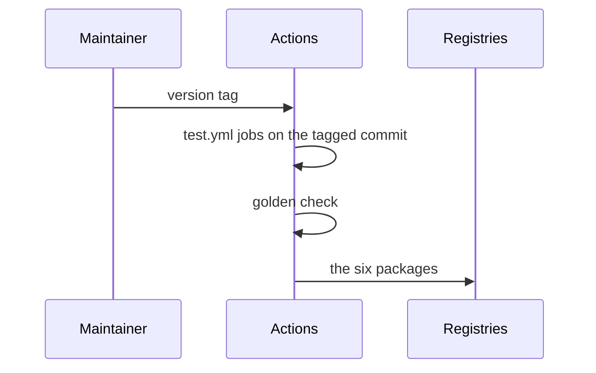
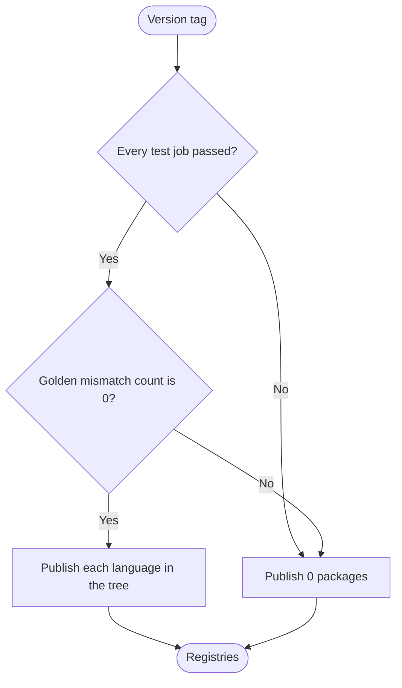

# packbin — System Flows

## Flow Inventory

| # | Flow Name | Trigger | Primary Components | Criticality |
|---|-----------|---------|-------------------|-------------|
| F1 | Pack | caller has a value | any of the six language packages | High |
| F2 | Unpack | caller has bytes | any of the six language packages | High |
| F3 | Publish | version tag | GitHub Actions | High |
| F4 | Session | caller has a 32-byte seed | any of the six language packages | High |

## Flow Dependencies

| Flow | Depends On | Shares Data With |
|------|-----------|-----------------|
| F1 | a field list | F2, via the golden fixture |
| F2 | F1's byte layout | F1 |
| F3 | F1 and F2 passing on that commit | the same hex |
| F4 | F1's clear bytes | the other side of the same session |

## Flow F1: Pack

### Description

The caller passes a value. Pack writes only the fields that are present and returns the bytes. A `bool` sets its flag bit only for `true`. In C++ pack writes into the caller's buffer and returns a `Result` whose `offset` is the packet length.

### Preconditions

- The field list is the one the caller intends for this packet
- Each present integer fits its width

### Sequence Diagram

```mermaid
sequenceDiagram
    participant Caller
    participant Pack
    Caller->>Pack: value
    Pack-->>Caller: bytes
```

### Flowchart

```mermaid
flowchart TD
    Start([Caller calls pack]) --> Fit{Integer fits the width?}
    Fit -->|Yes| Write[Write each present field]
    Fit -->|No| Err[Return an error and 0 bytes. C++: BufferFull or BadValue at an offset]
    Write --> EndNode([Bytes])
    Err --> EndNode
```

### Data Flow

| Step | From | To | Data | Format |
|------|------|----|------|--------|
| 1 | Caller | Pack | field values | the language's numbers |
| 2 | Pack | Caller | packet | raw bytes |

### Error Scenarios

| Error | Where | Detection | Recovery |
|-------|-------|-----------|----------|
| Integer outside the width | Pack | the value does not fit (TypeScript, loop 13: also a non-number, a fractional or unsafe number, a `bigint` in a float) | 0 bytes written |
| Output buffer too small (C++) | Pack | `BufferFull` with the offset and the bytes needed | nothing is written past the reported offset |
| Field list refused | Building the field list | a `bool` or empty group outside `flags` / a flag-byte bit, a ninth flag bit, an empty group that could never set its bit, a reference to a later, outer or undeclared field (C#, TypeScript, Java, C++; Rust numeric ids), a nested `repeat` / `times` round (Java, C#, TypeScript; Rust where it would lose data), a field declared for another row type (C#), a member name used inside an unanchored group and outside it (TypeScript), a `when` on a non-integer source or a composite `list` / `dict` element (Rust) | no scheme; the error names the field |
| Set flag group misses a value (C#) | Pack | a value-bearing child of a group whose bit is on is null | `ArgumentException` naming the child; nothing returned |
| Required value missing (C#) | Pack | a walked field outside a flag bit has no value, or a `times` list holds more items than its count | `ArgumentException` naming the member and its field id; nothing returned |
| Times count and `Vec` disagree (Rust typed) | Pack | the count field is not the length of the `Vec` | `PackError::Type` naming the `times`; nothing returned |
| Bool value not 0 / 1 (Rust map API) | Pack | `PackError::Type` | nothing returned |

### Performance Expectations

| Metric | Target | Notes |
|--------|--------|-------|
| End-to-end latency | part of the 1 second budget | 100000 round trips with unpack |
| Throughput | 100000 round trips ≤ 1 second | one core, position fixture |

## Flow F2: Unpack

### Description

The caller passes a buffer. Unpack returns the value, or an error and no value. The buffer is untrusted: in C#, TypeScript, Python, Rust and Java a bad buffer is always an error value, never an exception or a panic, and unpack ends within a time and memory bound set by the buffer length. In C#, TypeScript, Java and Rust each scheme also carries two limits, 65,535 rounds per `repeat` or `times` field and 4,194,304 slots per call by default, and refuses the round that would pass either before it is read (loop 15). In C++ unpack fills the caller's row and returns a `Result`; on failure the fields read before it keep their values.

### Preconditions

- The field list matches the layout that produced the buffer

### Sequence Diagram

```mermaid
sequenceDiagram
    participant Caller
    participant Unpack
    Caller->>Unpack: bytes
    Unpack-->>Caller: value or error
```

### Flowchart

```mermaid
flowchart TD
    Start([Caller calls unpack]) --> Enough{Field fits in the bytes left?}
    Enough -->|Yes| Valid{Count, text and round valid?}
    Enough -->|No| Short[Error, value count 0. C++: ShortPacket with offset and order id]
    Valid -->|Yes| Next[Read the field]
    Valid -->|No| Bad[Interim error, value count 0]
    Next --> More{Another field?}
    More -->|Yes| Enough
    More -->|No| Tail{Bytes left?}
    Tail -->|0| Ok([Value])
    Tail -->|1 or more| Trail[Error, value count 0. C++: TrailingBytes]
    Short --> EndNode([Stop])
    Bad --> EndNode
    Trail --> EndNode
```

### Data Flow

| Step | From | To | Data | Format |
|------|------|----|------|--------|
| 1 | Caller | Unpack | packet | raw bytes |
| 2 | Unpack | Caller | fields or a short packet | value, or field name plus two counts. C++: `Result` with error kind, byte offset, field order id and bytes needed |

### Error Scenarios

| Error | Where | Detection | Recovery |
|-------|-------|-----------|----------|
| Short field | Unpack | remaining bytes are fewer than the width | no value; the next call is independent. C++ keeps the fields read before the failure in the row |
| Trailing bytes | Unpack | bytes remain after the list, or a `repeat` round read 0 bytes with bytes left | no value; the `repeat` ends instead of looping |
| Bad value (C#, TypeScript, Python, Rust, Java) | Unpack | a negative count; a count whose source field is absent behind a clear flag bit; invalid UTF-8 in a string or dictionary key; a `times` round or a `list` or `dict` element that reads 0 bytes | no value, no exception. The error is a short-packet-style value, interim until C15 sets its kind and label |
| Round past a limit (C#, TypeScript, Java, Rust) | Unpack | the round that would be the 65,536th of one `repeat` or `times` field, or would take the slots of the call past 4,194,304 (defaults; the scheme sets them) | no value, no handler call; the same interim short-packet-style value, `needed` 0 and the bytes left. A `times` count is not refused up front |
| Count above the bytes left | Unpack | a string length, or a `sized`, `bits` or `packed` run, that needs more bytes than remain | short packet; the count is compared with the bytes left before it sizes anything |
| Count over capacity, bad count, duplicate dict key (C++) | Unpack | `TooMany` or `BadValue` with the offset | no value; no truncation |

### Performance Expectations

| Metric | Target | Notes |
|--------|--------|-------|
| End-to-end latency | part of the 1 second budget | measured with pack |
| Throughput | 100000 round trips ≤ 1 second | one core |

## Flow F3: Publish

### Description

A version tag on GitHub first runs the test workflow on that commit (read-only token, no secrets; the `publish` job `needs:` it, so any failing test job skips the publish). It then builds and checks every package of that commit, in containers that mount the repo read-only, and only then uploads the ones a registry does not yet hold. For C++ the same tag also feeds the embedded registries (PlatformIO, ESP-IDF component, Arduino).

### Preconditions

- Tests passed on the commit, in the same workflow run: the `publish` job runs only after the called `test.yml` jobs succeed
- All six languages' golden bytes match

### Sequence Diagram

```mermaid
sequenceDiagram
    participant Maintainer
    participant Actions
    participant Registries
    Maintainer->>Actions: version tag
    Actions->>Actions: test.yml jobs on the tagged commit
    Actions->>Actions: golden check
    Actions->>Registries: the six packages
```

### Flowchart

```mermaid
flowchart TD
    Start([Version tag]) --> Tests{Every test job passed?}
    Tests -->|No| None
    Tests -->|Yes| Match{Golden mismatch count is 0?}
    Match -->|Yes| Pub[Publish each language in the tree]
    Match -->|No| None[Publish 0 packages]
    Pub --> EndNode([Registries])
    None --> EndNode
```

### Data Flow

| Step | From | To | Data | Format |
|------|------|----|------|--------|
| 1 | Git tag | Actions | commit | git |
| 2 | Actions | the runner's `artifacts/<target>/` | built and checked packages (version, MIT, payload) | one artifact per target |
| 3 | Actions (runner host) | the registries | the checked files, each skipped when the registry already holds the version | registry tools |

### Error Scenarios

| Error | Where | Detection | Recovery |
|-------|-------|-----------|----------|
| Golden mismatch | Actions | byte mismatch count greater than 0 | 0 packages published |
| Language absent | Actions | that project is not in the tree | 0 packages for that registry |
| Test job fails | Actions | a job of the called `test.yml` fails | `publish` is skipped, 0 packages |
| Build or check fails | Actions | a target does not build, or `publish-check.py` rejects it | the run fails before the first upload, 0 packages |
| Required credential missing | Actions | a required target has no credential | the run fails before anything is built or written; an optional target is skipped with a warning |
| Upload fails after others succeeded | Actions | a registry tool or an existence query fails | the run fails; re-running the tag skips what is published and uploads the rest |

### Performance Expectations

| Metric | Target | Notes |
|--------|--------|-------|
| End-to-end latency | the check fails the workflow | not a latency SLO |
| Throughput | one publish per tag | first tag is exactly six packages |

## Flow F4: Session

### Description

The caller loads a 32-byte seed, the opener sends 16 bytes once, and the waiter joins. Later payloads are the clear packed bytes XORed to the same length. In C++ the opener passes a `RandomFn` (`packbin::os_random` on a host, a hardware RNG on firmware) or its own nonce, and the pad is applied in place on the caller's buffer.

### Preconditions

- Clear pack of the row is already the golden hex
- The caller holds the seed. The library does not store it and does not open a socket

### Data Flow

| Step | From | To | Data | Format |
|------|------|----|------|--------|
| 1 | Opener | Waiter | 16 bytes | raw |
| 2 | Opener | Waiter | payload | same length as clear pack |
| 3 | Waiter | Opener | the row | the five fields |

### Error Scenarios

| Error | Where | Detection | Recovery |
|-------|-------|-----------|----------|
| Seed length is not 32, or join length is not 16 | Load or Join | the call returns nothing (C++: `false`) | 0 sessions |
| The random function fails (C++) | Start | `start` returns `false` | the session does not open; the nonce output is unchanged |
| Pack before start or join | Pack | no payload (C++: `BadValue`) | 0 payloads |
| A payload is dropped | the next unpack on that direction | the row does not match | that direction stays out of step. There is no tag |

### Performance Expectations

| Metric | Target | Notes |
|--------|--------|-------|
| Payload length | equal to clear pack | added bytes 0 |
| Six languages | one payload | mismatched bytes 0 |
