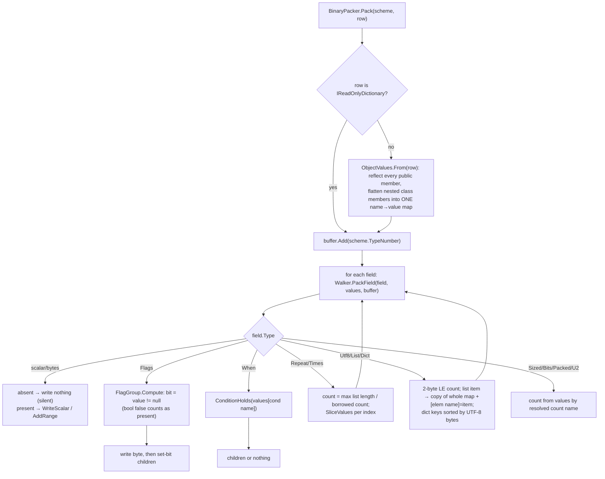

# Component discovery — C# package (`csharp/`)

**Run**: 02-whole-project-assessment (Quick Assessment, phase 1)
**Tree**: `loop/10-cpp-microcontroller` at `d108141`
**Spec**: `_docs/02_document/components/01_csharp_package/`, `_docs/01_solution/schema.md`, `_docs/02_document/contracts/library/pack-session.md`
**Smells and candidate changes**: `../scan_csharp_java.md`

## Purpose

NuGet `Packbin`. Packs a typed row into the exact field bytes behind a one-byte scheme type number, and unpacks a buffer by dispatching on that byte to a handler. Adds an optional `PackSession` (HKDF-SHA256 + ChaCha20 pad, same length as the clear packet). No runtime dependencies. Target `net10.0`.

## Structure

| File | Lines | Responsibility |
|------|-------|----------------|
| `Packbin.cs` | 310 | Public entry: `Scheme<T>`, `SchemeHandler`, `Condition`, error types (`ShortPacket`, `TrailingBytes`, `TypeMismatch`), `UnpackResult`, `BinaryPacker` (`Pack`, `Unpack`, internal `Read`/`ReadFields`), and the internal `SchemeOrder` validator |
| `Field.cs` | 234 | `Field` (one class for every kind, 16-arg private constructor), `Kind` enum (24 kinds), public static factories `Field.U8<T>(id, x => x.M)` … |
| `Fields.cs` | 61 | `Fields<T>` builder: 31 one-line forwards to `Field.*` so `new Scheme<T>(n, f => [...])` infers `T` |
| `FieldAccess.cs` | 54 | `MemberAccess`: validates `x => x.Member` and returns the member name (its `Get`/`Set` delegates are never used) |
| `Walker.cs` | 455 | `FlagGroup` (bit list + mutable `Unpacked` byte) and `Walker` pack/unpack dispatch, flags, when, repeat, group, bytes, scalar, condition equality |
| `Walker.Scalars.cs` | 110 | Little/big-endian scalar write/read (`BinaryPrimitives`) |
| `Walker.Counted.cs` | 376 | sized, u2, bits, packed, times, utf8, list, dict (2-byte LE counts, unsigned key-byte order) |
| `ObjectValues.cs` | 162 | Reflection bridge row object ⇄ flat `Dictionary<string, object?>`; also the unused public `Bound<T>` |
| `PackSession.cs` | 77 | Session `Load/Start/Join/Pack/Unpack` |
| `SessionPad.cs` | 88 | Hand-written ChaCha20 block + XOR (no raw ChaCha20 stream in .NET; AEAD would add a tag) |
| `Packbin.csproj` / `.slnx` | 27 / 6 | Package metadata (MIT, README packed), `InternalsVisibleTo Packbin.Tests` |
| `tests/*.cs` | 1661 | xunit: `PackbinTests` (AC-1..5, AC-10), `LayoutTests` (**517 lines**), `SchemeTests`, `FieldIdBindingTests`, `BorrowedCountTests`, `ObjectBindingTests`, `SessionTests`; `tests/compile-fail/` (a `dotnet build` that must fail) |

Lizard: 1755 NLOC, 186 functions, avg CCN 2.4. CCN > 10: `WriteScalar` 19 (70 NLOC), `PackField` 17 (57 NLOC), `SchemeOrder.Walk` 14 (52 NLOC), `SchemeOrder.ResolveField` 14. `Field` constructor has 16 parameters.

## Flows

### Pack



### Unpack (type-number dispatch)

```mermaid
flowchart TD
    A["BinaryPacker.Unpack(bytes, handlers…)"] --> B{duplicate TypeNumber?}
    B -- yes --> X[throw ArgumentException]
    B -- no --> C{bytes empty?}
    C -- yes --> S["ShortPacket('', 1, 0)"]
    C -- no --> D{handler with TypeNumber == bytes[0]?}
    D -- no --> T["TypeMismatch(expected 0, actual)"]
    D -- yes --> E["ReadFields(scheme.Fields, bytes[1..])"]
    E --> F["Walker.UnpackField per field into Dictionary&lt;string, object?&gt;<br/>(Flags: writes FlagGroup.Unpacked on the shared scheme)"]
    F -- error --> R[return ShortPacket / TrailingBytes, handler not called]
    F -- ok --> G["ObjectValues.To&lt;T&gt;(values): reflect, convert, build nested objects"]
    G --> H["handler(row); return null"]
```

### Field-order validation (`SchemeOrder`, at `Scheme<T>` construction)

`Walk` numbers value-bearing fields from 0 in list order; `when/repeat/times/flags` and continuing groups must carry an anchor equal to the next id; nested rows, list and dict elements open a fresh scope from 0. After the whole list is walked, `Resolve` looks up condition/count ids in the full scope and **mutates** the shared `Field.CountName` / `Condition.FieldName`. Because resolution runs after the walk, an id that appears later in the list is accepted (forward reference).

### PackSession

`Load(32 bytes)` → `Start()` / `Start(nonce16)` / `Join(nonce16)` → HKDF-SHA256(seed, salt = nonce, info = `packbin`, 64 bytes): opener sends with the first half, waiter swaps; seed and the 64-byte buffer are zeroed. `Pack` = clear pack then XOR with ChaCha20(key, nonce = LE counter, block 0); `Unpack` = copy, XOR, counter++, then clear `Unpack`. Before open: `Pack` returns `null`, `Unpack` returns `ShortPacket("", 1, 0)`.

## Public API

| Member | Signature | Notes |
|--------|-----------|-------|
| `Scheme<T>` | `new(int typeNumber, params Field[] fields)` / `new(int, Func<Fields<T>, Field[]>)` | 0..255; validates order; stores the caller's array without copying |
| `Scheme<T>.On` | `SchemeHandler On(Action<T>)` | |
| `Field.*<T>` / `Fields<T>.*` | `U8..F64`, `Bytes`, `Bool`, `Utf8`, `Sized`, `Bits`, `Packed`, `U2`, `Times`, `Flags`, `FlagByte`+`Bit`, `When`, `Repeat`, `Group` (nested / continuing), `List`, `Dict`, `Be()` | `Field.*<T>` is not tied to the scheme's `T` |
| `Condition.Eq` | `(int fieldId, object value)` | |
| `BinaryPacker.Pack` | `byte[] Pack<T>(Scheme<T>, T?)`, `Pack<T>(Scheme<T>, IReadOnlyDictionary<string, object?>)` | throws on bad values |
| `BinaryPacker.Unpack` | `object? Unpack(ReadOnlySpan<byte>, params SchemeHandler[])` | `null` = handler ran; else an error object |
| Errors | `ShortPacket(Field, Needed, Left)`, `TrailingBytes(Left)`, `TypeMismatch(Expected, Actual)` | plain classes, no common base |
| `UnpackResult`, `Bound<T>` | public | `UnpackResult` only used internally; `Bound<T>` unused |
| `PackSession` | `Load`, `Start()`, `Start(nonce)`, `Join`, `Pack<T>`, `Unpack`, `SeedSize = 32`, `NonceSize = 16` | caller-held, not thread-safe |

## Implementation details

- Values travel as a flat `Dictionary<string, object?>` keyed by **C# member name**; the order id is only used at construction. Error `ShortPacket.Field` is therefore the PascalCase member name (`"Lon"`, `"Login"`), `""` for a flags byte, the empty buffer, and a session that is not open.
- Presence = key present and not `null`. A non-nullable `bool false` is present.
- Scheme objects carry runtime state: `FlagGroup.Unpacked` is written on every unpack; `CountName`/`FieldName` are written at construction.
- `ObjectValues` re-reflects `GetProperties()/GetFields()` and boxes every value on every call; the typed path is ~9× slower than the dictionary path (probe: 719 ms vs 81 ms Release, 933 ms vs 195 ms Debug, 100 000 position round trips on an M-series Mac). The AC-10 test times only the dictionary + internal `Read` path.
- Duplicate dictionary key on unpack is reported as `ShortPacket(name, 0, 0)`.
- Exceptions, not error values, for: duplicate handler type numbers, pack-side invalid values, and (unintended) several unpack paths on hostile input.

## Caveats (verified with throw-away probes in the scratchpad, sources copied, repo untouched)

| # | Behavior | Probe result |
|---|----------|--------------|
| 1 | `bool Straight = false` inside `Flags` | packs `0101`, unpacks `Straight = true`; Java packs `0100` |
| 2 | `Bool` outside `Flags` | writes 0 bytes; unpack always stores `true` |
| 3 | 9th field in one `Flags` | accepted; value silently dropped (`0100`) |
| 4 | `ushort? = null` bound to a non-flag field | silently omitted (`0107`, 2 bytes missing); Java throws `missing field` |
| 5 | `Field.U16<OtherRow>` inside `Scheme<Row>` | accepted; silently omitted |
| 6 | Outer `Name` + nested-group `Name` | outer value replaced by inner (`010202` for 1/2) |
| 7 | README C# example (list of `Role`, dict of `ActionList`) | `Pack` throws `RoleName: expected string`; `Unpack` throws `InvalidCastException` |
| 8 | Two threads unpacking different flag rows with one scheme | 2860 wrong rows / 400 000 |
| 9 | `u32` count `0xFFFFFFFF` / `i8` count `-1` on unpack | `OverflowException` / `ArgumentOutOfRangeException` / `ArgumentException` thrown |
| 10 | `Repeat` of a zero-width child + 1 trailing byte | infinite loop |
| 11 | `When` testing a later id | constructs; pack writes the group, unpack of its own bytes → `TrailingBytes` |
| 12 | `When` on an `F64` holding `NaN` | `OverflowException` (Convert.ToDecimal) |
