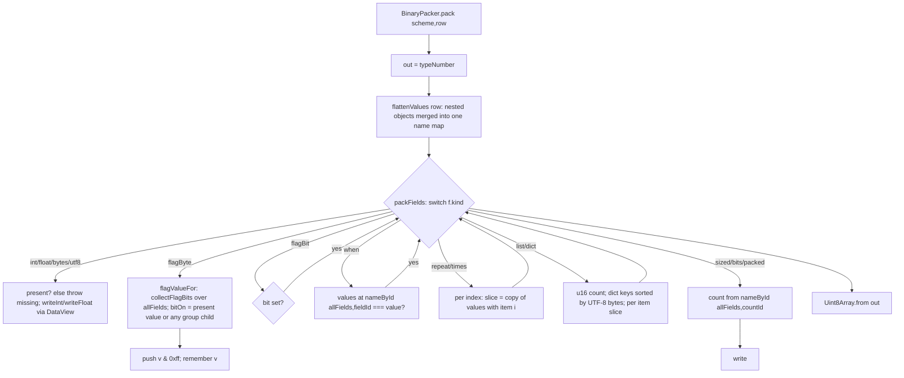
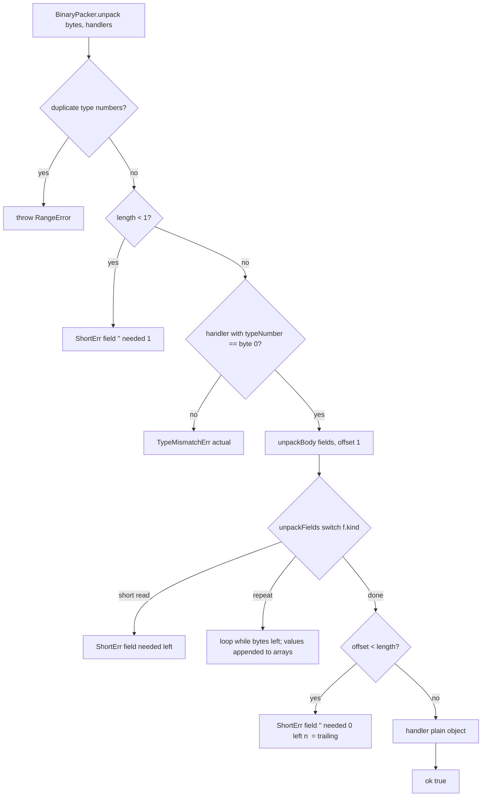

# Component discovery — TypeScript package

**Run**: `02-whole-project-assessment` · **Phase**: 1 (Discovery, read-only) · **Tree**: `d108141`
**Scope**: `typescript/src/*`, `typescript/tests/*`, `typescript/package.json` (not `node_modules`)
**Findings and change candidates**: [`../scan_typescript_python.md`](../scan_typescript_python.md)

## Purpose

npm `packbin`. Packs and unpacks a caller-written field list (a "scheme") for Vue, React, and Node, and offers the optional `PackSession` (HKDF-SHA256 + ChaCha20 pad, no tag). A peer of the other five packages. It imports none of them (ADR-001, module-layout rule 2).

## Structure

| File | Lines | Responsibility |
|------|-------|----------------|
| `src/index.ts` | 202 | Public entry: re-exports the field helpers, `Scheme`, `scheme()`, `BinaryPacker` (pack and dispatching unpack), `PackSession` |
| `src/fields.ts` | 426 | Field union type; builders (`u8` … `dict`); `memberName` (accessor → name by parsing `Function.prototype.toString`); `flatten` (turns `flags` into `flagByte` + `flagBit`); id-order validation; name lookup by id; `flattenValues` (row → one flat name map) |
| `src/walker.ts` | 458 | `packFields` and `unpackFields`: one `switch` on `kind` each; `unpackBody` (trailing-byte check) |
| `src/kinds.ts` | 314 | Per-kind byte readers and writers: ints, floats, utf8, u2, bits, packed, sized; `ShortErr` / `TypeMismatchErr` types |
| `src/session-pad.ts` | 94 | ChaCha20 block function (RFC 8439) and the XOR pad |
| `tests/*.test.ts` | 1504 | `node:test` suites: position golden (AC-1..9), fields, borrowed count, scheme and dispatch, binding, session; one `compile-fail` fixture run through `tsc` |

Import graph (no cycles): `index → fields, walker, kinds, session-pad, @noble/hashes`; `walker → fields, kinds`; `fields → kinds`; `kinds → none`.

Runtime dependency: `@noble/hashes` 2.4.0 (pinned) for HKDF and SHA-256. Dev: `typescript ^5.9.2` (used only by the compile-fail test). No `tsconfig.json` for the package and no build step: `package.json` `exports` points at `./src/index.ts`, and the publish script ships `src/*.ts` as-is.

## API

| Export | Shape | Notes |
|--------|-------|-------|
| `u8 … i64`, `f32`, `f64` | `(id, acc) → Field` | name comes from `memberName(acc)` |
| `bytes(id, acc, n)`, `bool(id, acc)`, `utf8(id, acc)` | `Field` | `bool` writes no bytes; only a flag bit carries it |
| `be(field)` | `Field` | int/float/flagBit only; other kinds are returned unchanged with no error |
| `flags(anchor, fields)` | `Field` | short form; `flatten` turns it into an anonymous `flagByte("")` + bits |
| `flagByte(name)` + `.bit(field)` | handle | split form; the bit counter lives in the handle closure; no 8-bit limit |
| `eq(id, value)`, `when(anchor, cond, fields)` | `Field` | `===` comparison |
| `repeat(anchor, fields)`, `times(anchor, countId, fields)` | `Field` | |
| `group(acc, fields)` / `group(anchor, acc, fields)` | `Field` | without anchor: nested object, ids restart at 0; with anchor: continues the parent ids |
| `sized`, `u2`, `bits`, `packed` | `Field` | count read from an earlier field by id |
| `list(acc, element)`, `dict(acc, element)` | `Field` | element is one flattened field, not `repeat` |
| `scheme<T>(typeNumber, ...fields)` | `Scheme<T>` | validates 0..255 and the id order; stores flattened fields |
| `Scheme.on(handler)` | `SchemeHandler<T>` | |
| `BinaryPacker.pack(scheme, row)` | `Uint8Array` | type number first; throws `RangeError` on a missing required field |
| `BinaryPacker.unpack(bytes, ...handlers)` | `{ok:true} \| ShortErr \| TypeMismatchErr` | handler gets a plain object (not an instance of `T`) |
| `PackSession.load/start/join/pack/unpack` | as in `contracts/library/pack-session.md` | not-open `unpack` returns `{ok:false, field:"", needed:1, left:0}` |
| types `Field`, `Acc`, `Value`, `ShortErr`, `TypeMismatchErr`, `UnpackErr`, `DispatchResult`, `SchemeHandler`, `UnpackOk`, `UnpackResult` | | `UnpackOk` / `UnpackResult` are not returned by any function (stale) |

## Flows

### Pack

### Unpack (type-number dispatch)

### Field-order validation

`scheme()` → `validateFieldIds(fields, 0)`: value fields must equal `next`; `flags`/`when`/`repeat`/`times`/anchored `group` must have `anchor === next` and continue the count into their children; an unanchored `group`, a `list` and a `dict` restart at 0; `flagByte` takes no id; a `flagBit` validates its field in place. Then `flatten`.

### PackSession

`load(32 bytes)` copies the seed → `start()` draws 16 bytes with `globalThis.crypto.getRandomValues` (web API, no Node import), or `start(nonce)` / `join(nonce)` → `#open`: HKDF-SHA256(seed, salt = nonce, info = "packbin", 64) → opener sends with the first half, waiter swaps; seed wiped. `pack`: clear pack, XOR ChaCha20 pad (nonce = 64-bit LE counter + 4 zero bytes, block counter 0), counter + 1. `unpack`: copy, XOR with the receive counter, counter + 1 (also on failure, as the contract says), clear unpack.

## Implementation details

- Values are one flat `Record<string, unknown>`. `flattenValues` merges every nested plain object into the top level, so a nested group's member names share one namespace with the parent. Unpack also writes a nested group's members flat (tested: "packs a class instance and flattens a nested group").
- Ids appear only at construction. Every count and `when` lookup at pack/unpack time is `nameById(allFields, id)`: a depth-first search from the top of the scheme, repeated on every call.
- Integer writes go straight to `DataView.setUint8/16/32`, `setInt*`, `setBig*64`. There is no range check.
- `bool` presence is `present(value)` (`!== undefined && !== null`), so `false` counts as present.
- The flag byte's raw value is stored in the result row under the flag byte's name (`""` for the short form).
- No `try`/`catch` anywhere in `src`. Errors are thrown `RangeError`s (construction and pack) or returned result objects (unpack). Unpack still throws in a few wire-dependent cases: invalid UTF-8 (`TextDecoder` fatal), and a count field that is absent because its flag bit is clear.
- Browser safety: `src` imports nothing Node-only. The only non-local imports are `@noble/hashes/hkdf.js` and `@noble/hashes/sha2.js`. The other globals in use (`TextEncoder`, `TextDecoder`, `globalThis.crypto.getRandomValues`, `DataView`, `BigInt`) are web-standard. Checked with `grep -nE "node:|Buffer|process|require\(|__dirname|globalThis|crypto|TextEncoder|TextDecoder" typescript/src/*.ts`. `node:` imports appear only in tests.

## Complexity (lizard 1.24 + manual count)

| Function | CCN | NLOC | Note |
|----------|-----|------|------|
| `walker.ts` `unpackFields` | ~70 (manual: 18 `case`, 40 `if`, 7 `for`, 1 `while`, 3 `&&`/`??`) | 216 | **not measured by lizard**: the TS parser loses sync after `packFields` |
| `walker.ts` `packFields` | 43 | 115 | lizard |
| `fields.ts` `validateFieldIds` | ~26 (manual) | 56 | lizard reports `fields.ts` as one 420-NLOC function `memberName`, because the regex literal at line 35 confuses its tokenizer |
| `fields.ts` `findNameById` | ~20 (manual) | 32 | same |
| `kinds.ts` `writePacked` | 12 | 24 | lizard |

The baseline TS row in `baseline_metrics.md` ("2 functions CCN > 10, 1 > 50 NLOC") undercounts. At least 4 functions are over CCN 10 and 2 are over 50 NLOC.

## Caveats

1. **Silent integer wrap on pack.** `u8` 300 → `2c`, `u8` −1 → `ff`, `u8` 1.7 → `01`, `i32` 3e9 → wraps, `u64` −1n → `ff…`. This contradicts architecture §4 ("pack refuses an integer that does not fit") and the component doc ("integer does not fit"). Python raises `OverflowError`.
2. **`bool` false sets the bit.** `{on:false}` under `flags` packs `0101`, and unpack yields `on: true`. A bool outside `flags` always unpacks as `true`. Python packs the same row as `0100`, so the two languages disagree on bytes for one row.
3. **Flags inside a nested group are dropped on pack.** `collectFlagBits` does not recurse into `group`, so the flag byte is written as `00` and the child is omitted with no error.
4. **More than 8 flag bits are accepted.** Pack writes `v & 0xff` but still writes the 9th field, so the result does not unpack (trailing-byte error).
5. **Name collisions in nested groups.** `{sid:1, g:{sid:2}}` packs the outer `sid` as `2`.
6. **`when` / count id lookup ignores scope.** Inside an unanchored group (ids restart at 0), `eq(0, …)` resolves to the top-level field 0. `===` also fails between `bigint` (u64/i64 unpack) and `number` (pack), so pack writes the group and unpack skips it.
7. **List or dict of `group` does not work.** Pack throws `missing a` because it reads the group's children from the top-level values, and unpack would push `undefined`. The feature spec allows any element except `repeat`.
8. **`repeat` whose body can read 0 bytes hangs unpack** (confirmed: process killed by a 5 s alarm).
9. **Error sentinels instead of types.** Trailing bytes is `ShortErr{field:"", needed:0}`, an empty buffer is `{field:"", needed:1, left:0}`, session-not-open is the same value as an empty buffer, and a duplicate dict key is `{needed:0, left:0}`. The other five languages have a separate `TrailingBytes`.
10. **Packaging: Node consumers cannot import the published package.** Node refuses to strip types under `node_modules` (`ERR_UNSUPPORTED_NODE_MODULES_TYPE_STRIPPING`, reproduced with Node 22.23 from a scratch `node_modules/packbin`). A `tsc` consumer would also need `allowImportingTsExtensions`. Vite works. The component doc names Node as a consumer.
11. Dead code: the `flags` cases in both walkers (`scheme()` already flattened them; if reached, a new `Symbol` would never match `allFields`), the no-op `if` at `walker.ts:315`, the stale exported types `UnpackOk` and `UnpackResult`, and `TypeMismatchErr.expected`, which is never set.
12. Tests: no test of the split form (`flagByte`), list/dict of group, bool `false`, out-of-range ints, or flags in a nested group. `src` is type-checked only as a side effect of the compile-fail test, which passes on *any* `tsc` error. `npx tsc --noEmit --strict … src/index.ts` passes today (verified). No coverage collection.
