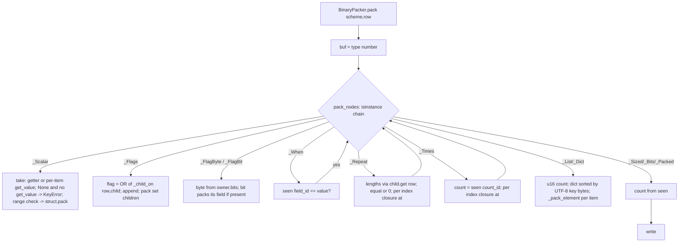
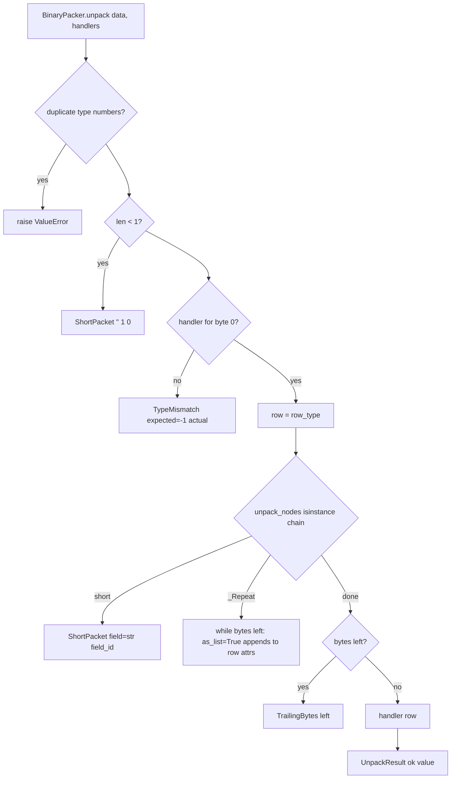

# Component discovery — Python package

**Run**: `02-whole-project-assessment` · **Phase**: 1 (Discovery, read-only) · **Tree**: `d108141`
**Scope**: `python/src/packbin/*`, `python/tests/*`, `python/pyproject.toml`
**Findings and change candidates**: [`../scan_typescript_python.md`](../scan_typescript_python.md)

## Purpose

PyPI `packbin` for tools and scripts. Packs and unpacks a caller-written scheme with one member accessor per field (`lambda row: row.sid` or `lambda row: row["sid"]`), plus the optional `PackSession`. Zero runtime dependencies: HKDF uses stdlib `hmac`/`hashlib`, and ChaCha20 is pure Python. A peer package with no imports from the others.

## Structure

| File | Lines | Responsibility |
|------|-------|----------------|
| `__init__.py` | 71 | Public re-exports and `__all__` (includes `bool`, `bytes`, `dict`, `list`, which shadow builtins on `import *`) |
| `_nodes.py` | 424 | Accessor probe (`_Probe`/`_Hit` → getter/setter pair); node dataclasses (`_Scalar`, `_Flags`, `_FlagByte`, …); builder functions; `_validate_order` |
| `_pack.py` | 298 | `pack_nodes` (one `isinstance` chain), list/dict element helpers, packed/bits/u2 writers, int range check |
| `_unpack.py` | 360 | `unpack_nodes` (one `isinstance` chain, `seen` ids → values, `flag_state` by `id(owner)`), `_unpack_leaf` for list/dict elements |
| `_scheme.py` | 96 | `Scheme` (type number, row type, fields), `_Handler`, `BinaryPacker.pack/unpack/_unpack_dispatch`, trailing check |
| `_errors.py` | 49 | `ShortPacket`, `TrailingBytes`, `TypeMismatch`, `UnpackResult` (frozen dataclasses) |
| `_session.py` | 81 | `PackSession` |
| `_session_pad.py` | 71 | `hkdf_sha256`, ChaCha20 block, `xor_pad` |
| `tests/*.py` | 1060 | pytest: position (AC-1..10), fields, borrowed count, scheme dispatch, binding/accessor, session |

Import graph (no cycles): `__init__ → _errors, _nodes, _scheme, _session`; `_scheme → _errors, _nodes, _pack, _unpack`; `_session → _errors, _scheme, _session_pad`; `_pack/_unpack → _nodes (+ _errors)`.

## API

| Export | Shape | Notes |
|--------|-------|-------|
| `u8 … i64`, `f32`, `f64` | `(field_id, acc) → _Scalar` | min/max and `struct` format stored on the node |
| `bool(id, acc)`, `bytes(id, acc, n)`, `utf8(id, acc)` | node | `bool` writes nothing; presence is `value is True` |
| `be(field)` | `_Scalar` | `TypeError` for non-numeric fields |
| `flags(anchor, *fields)` | `_Flags` | no 8-bit check at construction (pack fails with `byte must be in range(0, 256)`) |
| `flag_byte()` + `.bit(field)` | `_FlagByte`, `_FlagBit` | split form; `.bit` caps at 8; **unusable in a `Scheme`** (see caveats) |
| `eq`, `when(anchor, eq, *fields)`, `repeat(anchor, *fields)`, `times(anchor, count_id, *fields)`, `group(anchor, *fields)` | node | `group` always continues the parent ids (there is no nested-object group) |
| `sized`, `u2`, `bits`, `packed` | node | counts are earlier field ids, read from `seen` |
| `list(acc, element)`, `dict(acc, element)` | node | element ids restart at 0; element rows on unpack are always `dict` |
| `Scheme(type_number, row_type, *fields)` | `Scheme[T]` | validates 0..255 and the id order |
| `Scheme.on(handler)` | `_Handler` | |
| `BinaryPacker.pack(scheme, row)` | `bytes` | raises `KeyError` / `TypeError` / `ValueError` / `OverflowError` / `RuntimeError` |
| `BinaryPacker.unpack(data, *handlers)` | `UnpackResult` (`ok`, `value`, `error`; `.field/.needed/.left` shortcuts) | row is `row_type()`; handler is called with it |
| `PackSession.load/start/join/pack/unpack` | as in the session contract | not-open `unpack` returns `ShortPacket("", 1, 0)`; the public `PackSession(seed)` constructor skips the 32-byte check |

## Flows

### Pack

### Unpack (type-number dispatch)

### Field-order validation

`Scheme.__init__` → `_validate_order(fields, 0)`: value nodes must equal `next_id`; `_Flags`/`_When`/`_Repeat`/`_Times`/`_Group` anchors must equal `next_id`, and their children continue the count; `_U2` validates its slots; `_FlagByte` validates **its `bits` list**, and each `_FlagBit` validates its field again; `_List`/`_Dict` elements restart at 0.

### PackSession

Same contract as TypeScript. `load` checks the length and returns `None`. `start` draws with `secrets.token_bytes(16)`. `_open` runs `hkdf_sha256(seed, salt=nonce, 64)` with `_INFO = b"packbin"`, assigns send/recv by role, and zeroes the seed bytearray. `pack`/`unpack` XOR a ChaCha20 pad keyed by the per-direction counter.

## Implementation details

- Accessor probe: `_pair(acc)` calls `acc(_Probe())`. An attribute read gives `getattr(row, key, None)` / `setattr`, an item read gives `row.get(key)` / `row[key] = v`, and any other expression raises `ValueError`. The member key is known here (`_Hit.key`) but is dropped: nodes keep only the getter and setter, so errors cannot name the field.
- `seen: dict[int, Any]` maps field id → last value, during pack and unpack. `when` and the borrowed counts read it, so "tests a field already read" holds in Python (unlike TS, which looks values up by name over the whole scheme).
- Unpack writes into a fresh `row_type()` instance. Repeated values go through `_append`, which turns an existing non-list value into `[old, new]`.
- Exceptions: one broad `except Exception` in `_pair`, re-raised as `ValueError(...) from exc` (not silent). Unpack raises (instead of returning an error) on invalid UTF-8 (`UnicodeDecodeError`) and on a count field absent from `seen` (`RuntimeError`).

## Complexity (lizard 1.24)

| Function | CCN | NLOC |
|----------|-----|------|
| `_unpack.py` `unpack_nodes` | 57 | 171 |
| `_pack.py` `pack_nodes` | 48 | 117 |
| `_nodes.py` `_validate_order` | 12 | 25 |
| `_pack.py` `_write_packed` | 11 | 12 |

All files are under 500 lines (largest `_nodes.py` 424).

## Caveats

1. **Short-packet `field` is the id as a string** (`"1"`, `"8"`), and `""` for flags, list, dict and dict-key errors. C# names the member (`"Lon"`) and TS names it (`"lon"`). This drifts from `languages.md` ("a short-packet error names the same field"), AC-8 and the README.
2. **Split-form `flag_byte` cannot be used in a `Scheme`.** `_validate_order` counts the bit fields twice, once under `_FlagByte.bits` and again at each `_FlagBit` (`field id 1 is not the next order 2`). There are no tests.
3. **Repeat/times + row defaults corrupt lists.** A dataclass with `lat: int = 0` unpacks `repeat` as `lat=[0, 10, 30]`.
4. **Repeat with a container child crashes on pack.** `repeat(1, flags(...))` → `AttributeError: '_Flags' object has no attribute 'get'`. In `times`, flag presence reads the whole list rather than item `i`, so a per-item `None` raises `TypeError`.
5. **List/dict of `group` with attribute accessors fails on unpack.** The element row is always a `dict`, so `setattr` fails. Item accessors work.
6. **`repeat` whose body can read 0 bytes hangs unpack** (confirmed with a 5 s alarm).
7. `PackSession(seed)` is public and skips the 32-byte check that `load` applies.
8. `from packbin import *` replaces the caller's `bool`, `bytes`, `dict`, `list`.
9. `TypeMismatch(expected=-1)` is a magic sentinel. The error types are mixed (`KeyError`, `RuntimeError`, `TypeError`, `ValueError`, `OverflowError`) for the same "bad row" class of failure.
10. `_unpack_leaf` repeats the scalar/bytes/utf8 branches of `unpack_nodes`. `_is_leaf` is defined twice. `_builtin_*` aliases are redefined in 4 modules. The repeat and times `at` closures are copies.
11. `pyproject.toml` has no `py.typed` marker, so type checkers ignore the package's annotations (minor). `pytest` is not installed on the host. Tests run in the CI container (44 pass per the baseline).
