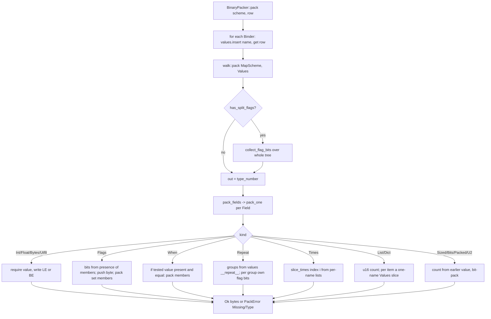
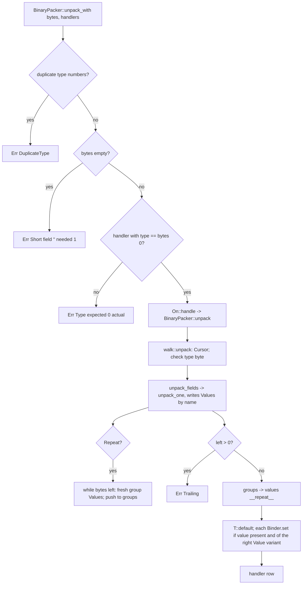

# Component 04 — Rust package (`rust/`)

**Tree**: `loop/10-cpp-microcontroller` @ `d108141`. Read-only discovery. Probe results below come from a scratch copy of the crate (`$SCRATCH/rustprobe`, in-crate `#[cfg(test)]` probes); nothing in `rust/` was edited or built.

## Purpose

crates.io `packbin`: pack and unpack the shared wire format (`_docs/01_solution/schema.md`) for a native Rust node, plus the optional `PackSession` pad (`_docs/02_document/contracts/library/pack-session.md`). Zero dependencies (`Cargo.toml` has no `[dependencies]`); SHA-256, HKDF and ChaCha20 are hand-written.

## Structure

| File | Lines | Role |
|------|-------|------|
| `src/lib.rs` | 24 | Public re-exports (the only public API file per `module-layout.md`) |
| `src/value.rs` | 185 | `Value` enum, `Values = HashMap<Rc<str>, Option<Value>>`, `ShortPacket`, `UnpackError`, `PackError`; number coercions (`as_usize`, `as_u2`, `as_bit`, `as_packed`); test helpers exported as public API (`to_hex`, `mismatched_bytes`, `motion_field_count`, `insert`) |
| `src/field/mod.rs` | 494 | `FieldKind` (19 kinds), `Field`, `MapScheme`, field constructors (`u8`…`times`), `FlagByte` (shared `Rc<RefCell<u8>>` bit counter), `count_fields`, `field_name` |
| `src/field/order.rs` | 120 | Field-order check (`check_order`, `take_id`, anchors, "not yet walked") — panics on failure; ids are recognised by parsing field **names** as numbers |
| `src/walk/mod.rs` | 13 | Forwarders `pack` / `unpack` (crate-private) |
| `src/walk/pack.rs` | 379 | Map-based pack walker; `pack_one` CCN 72 / 212 NLOC |
| `src/walk/unpack.rs` | 449 | Map-based unpack walker + `Cursor`; `unpack_one` CCN 66 / 325 NLOC |
| `src/scheme/mod.rs` | 276 | Typed `Scheme<T>`, `SchemeItem` (`Bound`, `When`, `Flags`, `Times`, raw `Field`), `compile_items` (CCN 15), `BinaryPacker::{pack, unpack_with}`, `On` / `DispatchHandler` |
| `src/scheme/bound.rs` | **514** | `BoundField<T>` constructors: 10 required scalars, `opt_u8`/`opt_u16` only, `bytes`, `utf8`, `sized`, `bits`, `packed`, `bool_flag`, and 4 hard-coded container shapes (`list_u16`, `list_utf8`, `dict_list_utf8`, `dict_list_dict_utf8`) |
| `src/session/{mod,hkdf,pad,sha256}.rs` | 121/46/92/113 | `PackSession`, HKDF-SHA256, ChaCha20 pad, SHA-256 |
| `src/*_tests.rs` | 189/443/430 | In-crate tests on the map walker (`borrowed_count`, `counted`, `packbin`) |
| `tests/*.rs` | 229/401/168 | Integration tests on the typed API (`field_id`, `scheme`, `session`) + a compile-fail crate |

Layering: `lib → {field, scheme, session, value, walk}`; `scheme → field, value, walk`; `walk → field, value`; `session → scheme, value`. No module cycle.

## Public API (as exported by `lib.rs`)

| Symbol | Kind | Notes |
|--------|------|-------|
| `Scheme<T>::new(type, items)` | typed scheme | panics on a bad type number or field order (AC-4 of scheme-field-order "construction fails") |
| `BoundField<T>::{u8…f64, opt_u8, opt_u16, bytes, utf8, sized, bits, packed, bool_flag, list_u16, list_utf8, dict_list_utf8, dict_list_dict_utf8}` | typed fields | no `opt_` for u32/u64/i8–i64/f32/f64; no typed u2, group, flag byte, repeat, generic list/dict |
| `SchemeItem::{when, flags, times}`, `SchemeItem::Field(Field)` | typed composites | raw `Field` items are never bound to the row (absent on pack, discarded on unpack) |
| `BinaryPacker::pack(&Scheme<T>, &T) -> Result<Vec<u8>, PackError>` | clear pack | |
| `BinaryPacker::unpack_with(bytes, &mut [&mut dyn DispatchHandler])` | clear unpack | `BinaryPacker::unpack` is private; `Scheme::on(handler)` builds a handler |
| `PackSession::{load, start, start_with, join, pack, unpack}` | session | `pack` returns `Option` (errors collapsed to `None`) |
| `MapScheme`, field constructors `u8("name")`…`times`, `be`, `eq`, `flag_byte`, `id_name`, `FieldKey` | map layout | `MapScheme` has **no public pack/unpack** (the loop-4 `pack_map`/`unpack_map` are gone); field constructors are only usable as raw `SchemeItem::Field` |
| `Value`, `Values`, `Name`, `insert`, `to_hex`, `mismatched_bytes`, `motion_field_count`, `ShortPacket`, `UnpackError`, `PackError` | values / helpers | `insert`, `Values`, `motion_field_count` have no external user; `to_hex` is used by the CI drivers, `mismatched_bytes` by integration tests |

## Flows

### Pack (typed)

### Unpack with type-number dispatch

Field-order validation runs twice for a typed scheme: `compile_items` (anchors, ids, "not yet walked") and again `MapScheme::new → check_order` on the compiled layout.

## Implementation details

- **Names are the identity.** Typed fields are named by their id string (`id_name(3) == "3"`); `order.rs::parse_id` treats any numeric name as an order id and any other name as a free slot. Values travel in a `HashMap<Rc<str>, Option<Value>>`, so two fields with the same name overwrite each other.
- **Hidden reserved names**: `"__repeat__"` (repeat groups, `pack.rs:223`, `unpack.rs:446`), `"__flags_{n}"` (`scheme/mod.rs:142`), `"__list"`, `"__list_{id}"`, `"__dict"`, `"__row"` (`bound.rs:365-462`).
- **Error mapping**: every non-short unpack failure (missing/non-integer count, negative packed count, invalid UTF-8, duplicate dict key, list element missing, session not open) is reported as `UnpackError::Short` with `needed: 0` (15 construction sites); unknown type in `unpack_with` is `Type { expected: 0, … }`.
- **Panics**: construction only (`MapScheme::new`, `check_order`, `packed`, `list`, `dict`, `compile_items`). Probed panic/hang paths on input are listed in `scan_rust_cpp.md` § (c).
- **Session**: `/dev/urandom` via `std::fs::File` (no Windows source; `start_with` exists); keys derived per contract; seed wiped; send/recv keys not wiped on drop.
- **Thread model**: `Scheme<T>`/`MapScheme`/`Field` are `!Send + !Sync` (`Rc<str>`, `Rc<RefCell<u8>>`, `Box<dyn Fn>` without `Send`), so a scheme cannot live in a `static` or be shared across threads.

## Caveats (summary; evidence in `scan_rust_cpp.md`)

1. `when` inside `repeat`/`times` that names an outer field passes construction, never matches, and a zero-width repeat body spins forever (probe P5: hang).
2. `flags` with > 8 members / `flag_byte` with > 8 bits are accepted; pack panics in debug (`attempt to shift left with overflow`) and aliases bit k mod 8 in release.
3. Two `list_*`/`dict_*` bound fields in one typed scheme share a binder name; the second list is packed for both (probe P1).
4. Typed `SchemeItem::times` packs only count ≤ 1 (`Missing`) and drops the unpacked value (probe P12) — untested public API.
5. Composite elements lose data silently: `list(flags…)`, `list(group…)`, flags inside `times`, `repeat` inside `repeat` (probes P3, P6, P10, P11).
6. Typed-scheme kind coverage is narrower than the map scheme (LESSONS 2026-09-24): the golden position row's optional `altitude: i16` cannot be bound (no `opt_i16`), so every Rust driver/test uses an unbound raw `flags(…)`.
7. `bound.rs` is 514 lines (over the 500 soft cap); 14 constructors repeat the same `if let Value::X(x) = v { Some(*x) } else { None }` block.
8. `_docs/02_document/components/04_rust_package/description.md` drifts from the code (see scan § (c) documentation drift).
