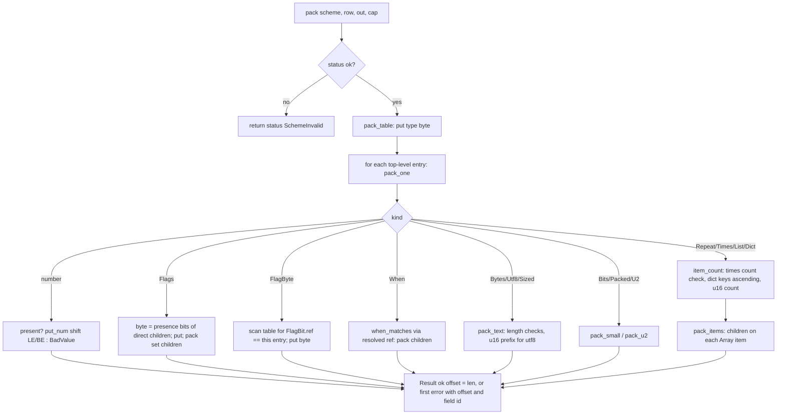
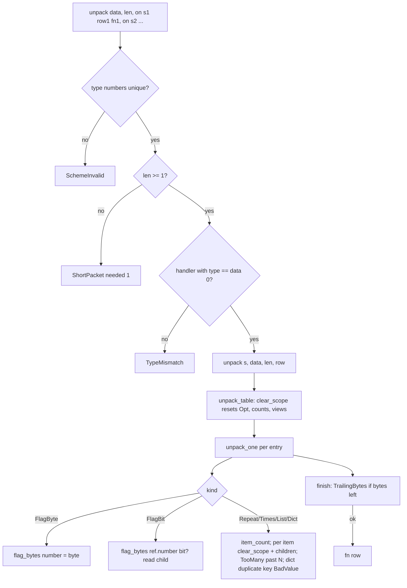

# Component 05 — C++ package (`cpp/`, excluding `cpp/embedded/`)

**Tree**: `loop/10-cpp-microcontroller` @ `d108141`. Read-only discovery. One probe (`$SCRATCH/cppprobe/probe.cpp`, linked against `cpp/src/core/*.cpp`, built outside `cpp/build`) confirmed the findings marked "probe".

## Purpose

One allocation-free, exception-free C++17 core (loop 10, decisions D-1 A / D-2 B) for host programs and 32-bit microcontrollers: pack a bound struct row into a caller buffer, unpack a caller buffer into a row, plus the `PackSession` pad with a caller random function. Published as vcpkg `packbin`, PlatformIO `zxsanny/packbin`, Arduino `packbin` (generated `arduino` branch) and ESP-IDF component `zxsanny/packbin`.

## Structure

| File | Lines | Role |
|------|-------|------|
| `include/packbin/packbin.hpp` | 9 | Public entry (module-layout public API): `codec.hpp`, `os_random.hpp`, `session.hpp` |
| `arduino/packbin.h` | 5 | Arduino entry: `codec.hpp` + `session.hpp` (no `os_random`) |
| `include/packbin/core.hpp` | 175 | `Error` enum (8 values), `Result {error, offset, field, needed}`, `Writer`/`Reader`, shift-based `store`/`load`, `put_num`/`get_num`/`put_bytes`/`get_bytes`/`finish`, `f64_supported` |
| `include/packbin/table.hpp` | 367 | `Kind` (26), `Opt<T>`, `View`, `Text<N>`, `Blob<N>`, `Array<T,N>`, `Entry<V,Key>`, `flag::` bits, `Field` table entry, `Node<C,N>`, member-pointer accessors, `bind_element`/`bind_storage` |
| `include/packbin/fields.hpp` + `fields_grouped.hpp` + `fields_counted.hpp` | 103 + 59 + 202 | Builders: scalars (macro), `f64`, `bytes`, `be`, `when`, `flags`, `group`, `flag_byte`, `flag_bit`, `utf8`, `sized`, `u2`, `bits`, `packed`, `repeat`, `times`, `list`, `dict` |
| `include/packbin/order.hpp` | 200 | `check_table`: order ids/anchors (`check_subtree`), shape (`flags` ≤ 8, invalid bindings), reference resolution scoped to the enclosing container (`find_ref`, `find_flag_byte`, `bit_position`) |
| `include/packbin/codec.hpp` | 174 | `Scheme<Row,N>`, `scheme<Row>(type, nodes…)` (compile error naming the id when `constexpr`), `validate`, `pack`, `unpack`, `on`, `unpack(data, len, handlers…)` dispatch |
| `include/packbin/session.hpp` / `src/core/session.cpp` | 96 / 337 | `PackSession` (`load`, `start(nonce)`, `start(RandomFn)`, `join`, `pack`, `unpack` in place), streaming SHA-256, HMAC, HKDF, ChaCha20 |
| `src/core/values.hpp` / `values.cpp` | 125 / 186 | Member access, presence (`present`), `read_int`, `when_matches`, `clear_scope`, text storage, number put/get via `visit_number` |
| `src/core/pack.cpp` | 275 | Pack walker: `pack_one` (CCN 23) + `pack_flags`, `pack_flag_byte`, `pack_text`, `pack_small`, `pack_u2`, `keys_ascending`, `item_count` |
| `src/core/unpack.cpp` | 279 | Unpack walker: `unpack_one` (CCN 22) + `unpack_text`, `unpack_small`, `unpack_u2`, `unpack_flags`, `check_new_key`, `item_count`, `unpack_items` |
| `include/packbin/os_random.hpp` / `src/os_random.cpp` | 14 / 46 | Host-only `RandomFn` (`arc4random_buf`, `getrandom`, `/dev/urandom` fallback) |
| `Makefile`, `CMakeLists.txt`, `library.json`, `idf_component.yml`, `arduino/library.properties` | 41/26/24/14/10 | Host test build (`build/packbin_tests`, compile-fail), CMake/ESP-IDF component, PlatformIO and Arduino manifests (version `0.1.0` rewritten at publish) |
| `tests/core/*.cpp`, `check.hpp`, `tests/compile-fail/*` | 1604 NLOC | Vector tests shared with the firmware runner, host-only tests (throughput, threads, core-has-no-OS scan), 7 compile-fail cases |

Embedded profile check (restrictions § Embedded profile): core headers/sources include only `<cstddef> <cstdint> <cstring> <type_traits> <array>`; 0 hits for `throw|try|new|malloc|std::function|shared_ptr|string|vector|map|variant|dynamic_cast|typeid` in `include/packbin` + `src/core`; only `static constexpr` / `static` member function, no mutable static state. **Profile honoured.**

## Public API

| Symbol | Input | Output / errors |
|--------|-------|-----------------|
| `scheme<Row>(type, nodes…)` | type 0..255, builder nodes | `Scheme<Row,N>` (`constexpr`: compile error `scheme_field_id_breaks_order<Id>`; runtime: `status = SchemeInvalid` + field id) |
| `validate(s)` | scheme | `s.status` |
| `pack(s, row, out, cap)` | row, caller buffer | `Result` (`offset` = length) — `BufferFull`, `BadValue`, `SchemeInvalid` |
| `unpack(s, data, len, row)` | caller buffer | `Result` — `ShortPacket` (+`needed`), `TrailingBytes`, `TypeMismatch`, `TooMany`, `BadValue`; row keeps fields read before a failure |
| `unpack(data, len, on(s, row, fn)…)` | handlers | runs `fn(row)` only after a full read; duplicate type numbers → `SchemeInvalid`; unknown → `TypeMismatch` |
| `PackSession::load/start/join/pack/unpack` | seed 32, nonce 16, `RandomFn` | `bool` / `Result` (`BadValue` before open) |
| `os_random` | — | host-only `RandomFn` |

## Flows

### Pack

### Unpack with type-number dispatch

Field-order validation: `check_table` = `check_subtree` (ids/anchors) → `check_shape` (flags ≤ 8, `flag::Invalid`) → `resolve` (when/count refs and flag bits, each looked up only inside the enclosing container scope). Runs inside `scheme<Row>()`; a `constexpr` scheme turns a failure into a compile error.

## Implementation details

- A scheme is a flat preorder table of `Field` entries (`span` = subtree size). Builders are `constexpr`; bound members are reached through `void* (*)(void*)` accessors generated per member pointer — no `std::function`, no RTTI.
- `Field::size` carries three meanings (bytes length, Text/Blob/Array capacity, flag-byte number) and `ref_id/ref` two (when/count source, flag byte) — compact flash table by design.
- Counted kinds write into `Array<T,N>`; an unbound container is read and skipped (no storage, no limit).
- `item_count` returns sentinels `SIZE_MAX` ("already failed") and `SIZE_MAX - 1` ("until the packet ends").
- `PackSession::pack` zeroes the clear bytes written before a failure; `unpack` advances the receive index for every unpadded packet (matches the contract).

## Caveats (summary; evidence in `scan_rust_cpp.md`)

1. **Logic bug (probe P1)**: unpack keeps one flag-byte value per *number* (`Walk::flag_bytes[8]`), but pack resolves bits per *table entry*. A container whose items reuse a flag-byte number overwrites the outer byte's slot, so an outer `flag_bit` after the container reads the inner value — a valid packet fails with `TrailingBytes` (or silently drops/misreads fields).
2. `boolean<…>` or an empty `group<…>` outside `flags` writes 0 bytes and always unpacks as `true` (probe P2); Rust leaves the same member false/absent.
3. `u2` with more than 64 children is a run-time `BadValue` (`pack.cpp:155` `raw[16]`), not a build error.
4. The public `packbin` namespace exposes table internals (`Field`, `Kind`, `Node`, `Access`, `Item`, `Count`, `flag::*`, `check_table`); with `using namespace packbin` (the README example) a user type named `Item` is ambiguous (seen in the probe). README's migration table says `Field` was removed.
5. Unbound (skipped) `dict` does not detect duplicate keys (F-AC-9 holds only for bound dicts).
6. Documentation drift: `components/05_cpp_package/description.md` still documents the removed 0.1.x dynamic API; `fields_counted.hpp:186` says dict keys "keep the caller's order on pack" while `pack.cpp:204` rejects non-ascending keys; `tests.md` ST-01 says "0 values" while the core keeps fields read before a failure (feature scenario S5).
7. `Makefile` writes host and container binaries to the same `build/` (LESSONS 2026-09-29).
