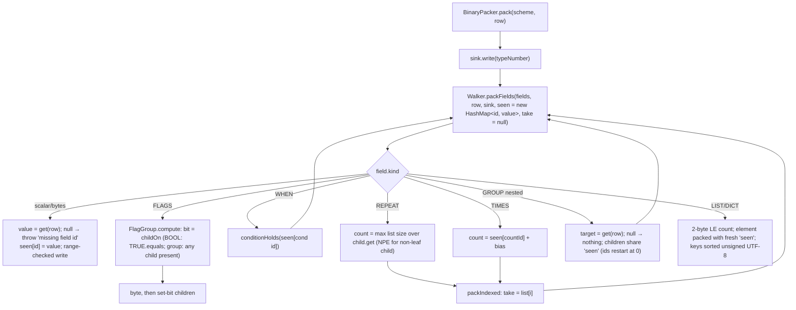

# Component discovery — Java package (`java/`)

**Run**: 02-whole-project-assessment (Quick Assessment, phase 1)
**Tree**: `loop/10-cpp-microcontroller` at `d108141`
**Spec**: `_docs/02_document/components/06_java_package/`, `_docs/01_solution/schema.md`, `_docs/02_document/contracts/library/pack-session.md`
**Smells and candidate changes**: `../scan_csharp_java.md`

## Purpose

Maven Central `io.github.zxsanny:packbin`, the package Android and other Java programs import. Same wire contract as the other five packages: one type byte, then the fields; typed rows bound through caller-supplied `Getter`/`Setter` lambdas, or `Map` rows through `Access.get("key")`. Optional `PackSession`. No dependencies and no build tool: `java/test.sh` runs `javac` + a hand-written test runner; `.github/workflows/publish-inside.sh` builds the jar, sources, javadoc and a generated POM.

## Structure

| File | Lines | Responsibility |
|------|-------|----------------|
| `Packbin.java` | 208 | Public entry: field factories (`u8`…`f64`, `bytes`, `boolField`, `be`, `flags`, `flagByte`, `eq`, `when`, `repeat`, `group` ×2, `sized`, `u2`+`u2Slot`, `bits`, `packed`, `times`, `utf8`, `list`, `dict`), error types `ShortPacket`, `TrailingBytes`, `TypeMismatch`, and `Bound<T>` |
| `BinaryPacker.java` | 88 | `pack(scheme, row)`, `unpack(data, handlers…)`, type-number dispatch, reflective `newRow` |
| `Scheme.java` | 37 | `Scheme<T>(typeNumber, Class<T>, Field…)` (copies the list, validates), `on(Consumer<T>)` → `Handler` |
| `SchemeOrder.java` | 125 | Field-order validation (same algorithm as C#; no mutation) |
| `Field.java` | 349 | `Field` (15-arg positional constructor called from 12 factories), `Kind` enum, `FlagGroup` (≤ 8 bits, mutable `unpacked`) |
| `Walker.java` | **497** | Dispatch, flags, when, repeat, group, bytes, scalar codec with range checks, `store` (list append for repeat/times) |
| `VarFields.java` | 462 | sized, u2, bits, packed, times, utf8, list, dict, element pack/unpack |
| `Access.java`, `Getter.java`, `Setter.java` | 51 / 6 / 6 | Accessor helpers and the two functional interfaces |
| `ByteSink.java` | 42 | Growable byte buffer |
| `PackSession.java` | 81 | Session `load/start/join/pack/unpack` |
| `SessionPad.java` | 130 | Hand-written HKDF-SHA256 (HMAC) and ChaCha20 (Android has no `javax.crypto.KDF`) |
| `test.sh` | 53 | Locates a JDK, compiles to `java/out/` (gitignored), runs four `main` test classes |
| `src/test/java/packbin/*` | 1523 | `PackbinTest` (+ `PackbinFieldsTest`), `SchemeTest` (incl. the `compile-fail` javac check), `FieldIdBindingTest`, `SessionTest`, helpers `Maps`, `ObjectRows` |

Lizard: 1883 NLOC, 166 functions, avg CCN 3.0. CCN > 10: `Walker.packField` 19, `unpackField` 17, `SchemeOrder.resolveField` 15, `walk` 13, `writeScalar` 11, `readScalar` 11, `Field.withBigEndian` 11. No function over 50 NLOC. `Walker.java` is 3 lines under the 500-line soft cap.

## Flows

### Pack



### Unpack (type-number dispatch)

```mermaid
flowchart TD
    A["BinaryPacker.unpack(data, handlers…)"] --> B{duplicate type number?}
    B -- yes --> X[throw IllegalArgumentException]
    B -- no --> C{data empty?}
    C -- yes --> S["ShortPacket('', 1, 0)"]
    C -- no --> D{handler for data[0]?}
    D -- no --> T["TypeMismatch(-1, actual)"]
    D -- yes --> E["decode: row = newRow(Class) (HashMap for Map rows)"]
    E --> F["Walker.unpackFields into row via setters; seen[id] = value<br/>(FLAG_BYTE: writes FlagGroup.unpacked on the shared scheme)"]
    F -- error --> R[return error, handler not called]
    F -- ok --> G{bytes left?}
    G -- yes --> TB[TrailingBytes]
    G -- no --> H["handler.accept(row); return null"]
```

### Field-order validation

Identical algorithm to C# (`walk` then `resolve` over the full scope), so a `when` or borrowed count that names a later id passes construction. `resolve` only checks presence; runtime lookups use ids through the per-call `seen` map.

### PackSession

Same contract as C#. `load` copies the seed; `open` runs HKDF over (seed, nonce, `packbin`), keeps two 32-byte keys, zeroes `both` and the seed. Before open, `pack` returns `null` and `unpack` returns `ShortPacket("", 1, 0)`.

## Public API

| Member | Signature | Notes |
|--------|-----------|-------|
| `Scheme<T>` | `new Scheme<>(int, Class<T>, Field...)` | `Map` rows need a raw `(Class) Map.class` cast |
| `Scheme.on` | `Handler<T> on(Consumer<T>)` | |
| `Packbin.*` | field factories listed above | `u2Slot` returns a `U8` field of size 0 that only works inside `u2` |
| `Access` | `get(String)`, `set(String)`, `get(Function)`, `set(BiConsumer)`, `identity()`, `ignore()` | setters receive untyped `Object` (callers cast `((Number) v).intValue()`) |
| `BinaryPacker` | `byte[] pack(Scheme<T>, T)`, `Object unpack(byte[], Handler<?>...)` | `null` = handler ran |
| Errors | `ShortPacket(field, needed, left)`, `TrailingBytes(left)`, `TypeMismatch(expected, actual)` | public final fields |
| `Packbin.Bound<T>` | public class, private ctor | only built inside `BinaryPacker`; `field()/needed()/left()` unused |
| `PackSession` | `load`, `start()`, `start(byte[])`, `join`, `pack`, `unpack`, `SEED_SIZE`, `NONCE_SIZE` | caller-held, not thread-safe |

## Implementation details

- Error field label is the **order id as a string** (`"5"`, `"8"`, `"0"` for a nested child), `"times"` for `times`, and `""` for a flags byte, a list or dict count or key, the empty buffer, a duplicate dict key (`ShortPacket("", 0, 0)`) and a session that is not open.
- `TypeMismatch.expected` is `-1` when no handler matches (C# uses `0`).
- U64 unpacks as a signed `long`; U32 as `Long`; U8/U16/I8/I16 as `Integer`.
- `seen` is per call (good), but nested rows share it with the parent even though their ids restart at 0.
- Packaging: the jar is compiled by the CI JDK (`eclipse-temurin:26-jdk`) without `--release`, and the code calls `Arrays.compareUnsigned(byte[], byte[])` (Android API 33) and `List.copyOf` (API 30). No check proves the published jar loads on Android, the named consumer.

## Caveats (verified with throw-away probes in the scratchpad, sources copied, repo untouched)

| # | Behavior | Probe result |
|---|----------|--------------|
| 1 | Split form `flagByte()` + `.bit()`, two threads unpacking different rows | 11 593 wrong rows / 400 000 (`flags()` form is safe: it reads a local) |
| 2 | Typed nested row `group(getter, setter, …)` whose member starts `null` | unpack throws `ClassCastException: HashMap cannot be cast to Inner` |
| 3 | Parent `u8(0)`, nested group child `u8(0)`, then `when(eq(0, 1))` | condition reads the nested child, not the parent (`01000109` with profile 0) |
| 4 | `repeat` containing `flags` (or `when`/`group`) | pack throws `NullPointerException` |
| 5 | `when` testing a later id | constructs; pack silently drops the group (`a = 5` not written) |
| 6 | `sized` counting from a later id | constructs; pack throws `IllegalStateException` |
| 7 | `u32` count `0xFFFFFFFF` / `i8` count `-1` on unpack | `NegativeArraySizeException` / `IllegalArgumentException` thrown |
| 8 | `repeat` of a zero-width child (`boolField`) + 1 trailing byte | infinite loop |
| 9 | `boolField` outside `flags` | writes 0 bytes, unpack stores nothing |
| 10 | Typed list/dict elements that are rows | elements become `HashMap` (same `newChild` path) — untested |
